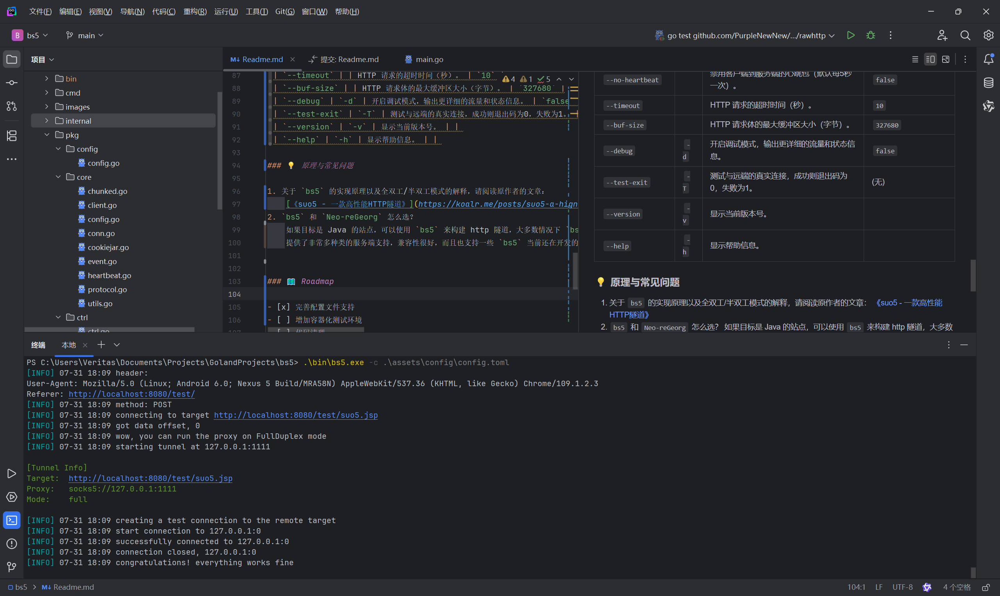

<h1 align="center">🚀 bs5 (Better Suo5) 🚀</h1>

<p align="center">
  <strong>一款为性能、伪装与工程化而生的超高性能 HTTP 隧道代理</strong>
</p>

<p align="center">
  <!-- Badges -->
  <a href="https://github.com/PurpleNewNew/bs5/actions/workflows/go.yml"></a>
  <a href="https://github.com/PurpleNewNew/bs5/releases/latest"></a>
  <a href="https://github.com/PurpleNewNew/bs5/blob/main/LICENSE"></a>
  <a href="https://go.dev/"></a>
</p>

<div align="center">
  <i>本项目深度重构自 <a href="https://github.com/zema1/suo5">suo5</a>，我们保留其精髓，并注入了现代化的工程思想。</i>
</div>

---

`bs5` 不仅仅是一个 HTTP 隧道。它是一个精心设计的网络穿透解决方案，利用 HTTP/S 协议作为载体，为您在严苛的网络环境中构建一条稳定、高速、且难以被察觉的 SOCKS5 代理通道。无论您是安全研究员、开发者还是网络工程师，`bs5` 都将成为您工具箱中的瑞士军刀。

## ✨ 为什么选择 bs5？
相比于原版的改进：

- 移除了urfave/cli，改为使用Cobra（相比原版有部分命令行参数不同）
- 使用Viper，增加了多种配置文件支持
- 项目结构管理更清晰，将部分外部依赖整合到internal软件包中
- 重命名包名称，重构包结构
- 使用Makefile清晰明的配置文件，方便构建

其主要特性如下：

- 同时支持全双工与半双工模式，传输性能接近 FRP
- 支持在 Nginx 反向代理和负载均衡场景使用
- 支持 Java4 ~ Java 21 全版本和各大主流中间件服务
- 支持 IIS .Net Framework >= 2.0 的所有版本
- 完善的连接控制和并发管理，使用流畅丝滑

## 🚀 快速上手

#### 1. 下载预编译文件

我们强烈建议您直接从 Releases 页面下载，这是最快、最简单的方式。

**[➡️ 前往 GitHub Releases 页面下载最新版本](https://github.com/PurpleNewNew/bs5/releases/latest)**

根据您的操作系统和CPU架构选择对应的压缩包即可。

#### 2. 部署服务端脚本

将 `/assets/webshell/` 目录中对应语言的脚本上传到您的目标服务器。例如，`suo5.jsp` 用于 Java Tomcat/JBoss 等环境。

#### 3. 启动客户端

```bash
# 示例：连接到部署好的 JSP Webshell
$ ./bs5-linux-amd64 -t https://example.com/suo5.jsp -l 127.0.0.1:1080
$ ./bs5-linux-amd64 -c config.json
```



## 🛠️ 参数详解

`bs5` 提供了丰富的命令行参数来满足您的各种定制化需求。

| 参数 (Flag) | 别名 | 功能说明 | 默认值 |
| :--- | :--- | :--- | :--- |
| `--target` | `-t` | **[必需]** 远端 Webshell 的 URL 地址。 | (无) |
| `--listen` | `-l` | 本地 SOCKS5 服务的监听地址和端口。 | `127.0.0.1:1111` |
| `--config` | `-c` | 指定外部配置文件路径 (支持 json, yaml, toml)。 | (无) |
| `--method` | `-m` | 连接远端时使用的 HTTP 请求方法。 | `POST` |
| `--auth` | | SOCKS5 认证凭据，格式为 `username:password`。 | 自动生成随机凭据 |
| `--no-auth` | | 禁用 SOCKS5 认证，允许匿名连接。 | `false` (即默认启用认证) |
| `--mode` | | 连接模式，可选 `auto`, `full` (全双工), `half` (半双工)。 | `auto` |
| `--ua` | | 自定义 HTTP 请求的 User-Agent。 | (一个常见的浏览器UA) |
| `--header` | `-H` | 添加自定义 HTTP 请求头，可多次使用。 | (无) |
| `--proxy` | `-p` | 设置上游代理，支持 `http(s)://` 和 `socks5://` 格式。 | (无) |
| `--redirect` | `-r` | 当 Host 不匹配时，重定向到此 URL，用于绕过负载均衡。 | (无) |
| `--exclude-domain` | `-E` | 排除指定的域名或IP，使其不通过代理。可多次使用。 | (无) |
| `--exclude-domain-file` | | 从文件中读取要排除的域名列表，每行一个。 | (无) |
| `--forward` | `-f` | 转发目标地址，启用后 `bs5` 将作为端口转发工具。 | (无) |
| `--jar` | `-j` | 启用 Cookie Jar，自动管理和发送 Cookies。 | `false` |
| `--no-gzip` | | 禁用 Gzip 压缩，以提高对旧服务器的兼容性。 | `false` |
| `--no-heartbeat` | | 禁用客户端到服务端的心跳包（默认每5秒一次）。 | `false` |
| `--timeout` | | HTTP 请求的超时时间（秒）。 | `10` |
| `--buf-size` | | HTTP 请求体的最大缓冲区大小（字节）。 | `327680` |
| `--debug` | `-d` | 开启调试模式，输出更详细的流量和状态信息。 | `false` |
| `--test-exit` | `-T` | 测试与远端的真实连接，成功则退出码为0，失败为1。 | (无) |
| `--version` | `-v` | 显示当前版本号。 | | 
| `--help` | `-h` | 显示帮助信息。 | | 

### 💡 原理与常见问题

1. 关于 `bs5` 的实现原理以及全双工/半双工模式的解释，请阅读原作者的文章：
    [《suo5 - 一款高性能HTTP隧道》](https://koalr.me/posts/suo5-a-hign-performace-http-socks/)
2. `bs5` 和 `Neo-reGeorg` 怎么选？
    如果目标是 Java 的站点，可以使用 `bs5` 来构建 http 隧道，大多数情况下 `bs5` 都要比 `neo` 更稳定速度更快。但 `neo`
    提供了非常多种类的服务端支持，兼容性很好，而且也支持一些 `bs5` 当前还在开发的功能，也支持更灵活的定制化。


### 🗺️ Roadmap

- [x] 完善配置文件支持
- [x] 修复有破坏性更新的依赖
- [ ] 增加容器化测试环境
- [x] 代码清理
- [ ] 流量特征消除
- [ ] 新增组网功能

### ❤️ 贡献

欢迎任何形式的贡献！您可以：
- 提交 Issue 来报告 Bug 或提出功能建议。
- Fork 本项目并提交 Pull Request。我们有 CI 流程会自动检查您的代码。

### 致谢

再次感谢原作者 [zema1](https://github.com/zema1) 开发了如此优秀的 [suo5](https://github.com/zema1/suo5) 工具。

---

> **免责声明**: 此工具仅限于授权的安全研究。用户需承担因使用此工具而导致的所有法律和相关责任！作者不承担任何法律及连带责任！